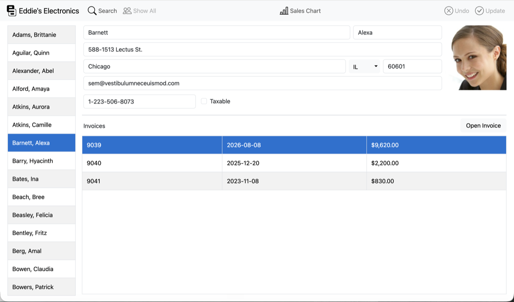

# EEWeb

<!-- Featured images come from the selected template; featured_portrait.png may be a mobile placeholder. -->
<picture class="featured">
  <source media="(max-width: 768px)" srcset="assets/featured_portrait.png">
  
</picture>

## Entities

| Name | Kind | Members | Super |
|---|---|---:|---|
| [AboutBoxDialog](./pages/aboutboxdialog.md) | Page / Window | 0 | — |
| [App](./classes/app.md) | Class | 9 | WebApplication |
| [ChartPage](./pages/chartpage.md) | Page / Window | 0 | — |
| [CustomerDetailsPage](./pages/customerdetailspage.md) | Page / Window | 0 | — |
| [CustomerDetailsToolbar](./classes/customerdetailstoolbar.md) | Class | 2 | WebToolbar |
| [DBField](./classes/dbfield.md) | Class | 1 | WebTextField |
| [DatabaseNotAvailablePage](./pages/databasenotavailablepage.md) | Page / Window | 0 | — |
| [ErrorDetailsDialog](./pages/errordetailsdialog.md) | Page / Window | 0 | — |
| [InvoiceDetailsDialog](./pages/invoicedetailsdialog.md) | Page / Window | 0 | — |
| [LogPage](./pages/logpage.md) | Page / Window | 0 | — |
| [MachineStatus](./classes/machinestatus.md) | Class | 13 | — |
| [MobileAbout](./pages/mobileabout.md) | Page / Window | 0 | — |
| [MobileChart](./pages/mobilechart.md) | Page / Window | 0 | — |
| [MobileCustomerDetailsPage](./pages/mobilecustomerdetailspage.md) | Page / Window | 0 | — |
| [MobileCustomerList](./pages/mobilecustomerlist.md) | Page / Window | 0 | — |
| [MobileSearchDialog](./pages/mobilesearchdialog.md) | Page / Window | 0 | — |
| [MobileToolbar](./classes/mobiletoolbar.md) | Class | 1 | WebToolbar |
| [OrdersDatabase](./classes/ordersdatabase.md) | Class | 21 | SQLiteDatabase |
| [SearchCustomersDialog](./pages/searchcustomersdialog.md) | Page / Window | 0 | — |
| [SelectablePopupMenu](./classes/selectablepopupmenu.md) | Class | 1 | WebPopupMenu |
| [Session](./classes/session.md) | Session | 10 | WebSession |
| [SystemUsageLogger](./classes/systemusagelogger.md) | Class | 3 | Timer |
| [TestForBrowserSize](./pages/testforbrowsersize.md) | Page / Window | 0 | — |
| [UtilLib](./classes/utillib.md) | Module | 1 | — |

> Entity types that exist in the official Xojo API link to [the Xojo documentation](https://documentation.xojo.com/index.html).

